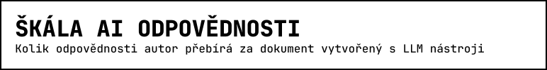
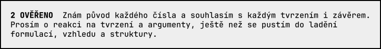

<picture>
  <source media="(prefers-color-scheme: dark)" srcset="assets/title-dark.svg">
  
</picture>

<a href="https://kutsosp.github.io/skala-ai-odpovednosti/uroven/2-overeno.html"><picture>
  <source media="(prefers-color-scheme: dark)" srcset="assets/stamp-dark.svg">
  
</picture></a>

[](https://github.com/Kutsosp/skala-ai-odpovednosti/actions/workflows/ci.yml)
[](https://kutsosp.github.io/skala-ai-odpovednosti/)
[](https://github.com/Kutsosp/skala-ai-odpovednosti/releases)
[](accountability.md)

Autor umístěním dokumentu na škálu (PŘEPOSLÁNO, NÁSTŘEL, OVĚŘENO, PODEPSÁNO) říká, za co v něm odpovídá a na co chce zpětnou vazbu. Definice úrovní a otázky: [accountability.md](accountability.md) · [web](https://kutsosp.github.io/skala-ai-odpovednosti/) · [English](https://kutsosp.github.io/skala-ai-odpovednosti/en/) (první překlad, 1 DRAFT).

## Jak označit dokument

Aplikace položí devět otázek ze škály, určí úroveň a vytvoří **odznak** (rámeček s názvem úrovně) nebo **razítko** (rámeček s textem odpovědnosti, nastavitelná šířka). Obojí je obrázek s odkazem na vysvětlení škály. Kde ji spustit:

| | Kde | Výsledek |
|---|---|---|
| **Web** | tlačítko *Určit úroveň a vytvořit odznak* na [webu](https://kutsosp.github.io/skala-ai-odpovednosti/#odznak) | zkopíruje odznak do schránky (⌘V / Ctrl+V do e-mailu, zprávy, dokumentu) |
| **Rozšíření pro Chrome** | ikona rozšíření | totéž ze schránky |
| | Google Docs, Sheets, Slides: položka *AI Škála* v horní nabídce | vloží odznak s odkazem rovnou do dokumentu: Docs první řádek, Sheets vybraná buňka, Slides aktuální snímek |

## Rozšíření pro Chrome

**Instalace**

1. Stáhněte `skala-ai-odpovednosti-extension-*.zip` z [Releases](https://github.com/Kutsosp/skala-ai-odpovednosti/releases) a rozbalte ho do složky, kterou nebudete mazat.
2. Otevřete `chrome://extensions`, zapněte *Režim pro vývojáře* (vpravo nahoře), zvolte *Načíst rozbalené* a vyberte rozbalenou složku.
3. V Chromu se objeví ikona rozšíření; v Google Docs, Sheets a Slides položka *AI Škála* v horní nabídce.

**Vkládání do Google dokumentů** vyžaduje při prvním použití souhlas s přístupem k vašim dokumentům; Google ho zobrazí sám. Aplikace je zatím v testovacím režimu Googlu, takže váš účet musí být na seznamu testovacích uživatelů (napište správci) a souhlas se jednou týdně obnovuje. Vše ostatní funguje bez přihlášení.

**Aktualizace**: stáhnout nový zip, přepsat složku, v `chrome://extensions` kliknout na ↻ u rozšíření.

## Repozitář

| | |
|---|---|
| [scale/](scale/) | texty škály (úrovně, otázky), jeden JSON na jazyk; zdroj pro odznaky i aplikaci |
| [badges/](badges/) | odznaky a razítka po jazycích, SVG (text jako křivky) a PNG; `build.py` je generuje |
| [extension/](extension/) | rozšíření pro Chrome; `popup.html` je zároveň aplikace pro web; texty rozhraní v `locales/` |
| [apps-script/](apps-script/) | Apps Script, který za rozšíření vkládá obrázek do Google dokumentů; nastavení v [README](apps-script/README.md) |
| [uroven/](uroven/) | stránka pro každou úroveň; na ni odkazují odznaky a razítka |
| `odznak.html` | aplikace v jednom souboru pro dialog na webu |

Stránky úrovní, `odznak.html` a kopii textů v rozšíření generuje `build.py`. Nový jazyk: `scale/<kód>.json`, `extension/locales/<kód>.json` a řádek v `scale/index.json`.

```bash
python3 build.py               # uroven/, odznak.html, extension/scale, apps-script/dist; pak (cd apps-script/dist && clasp push -f)
python3 badges/build.py        # odznaky, ikony, hlavička README (fonttools + Google Chrome)
git tag v1.1.0 && git push --tags   # GitHub Action přiloží zip rozšíření k vydání
```

Styl [The Monospace Web](https://owickstrom.github.io/the-monospace-web/) (Oskar Wickström, MIT), písmo JetBrains Mono (OFL).
